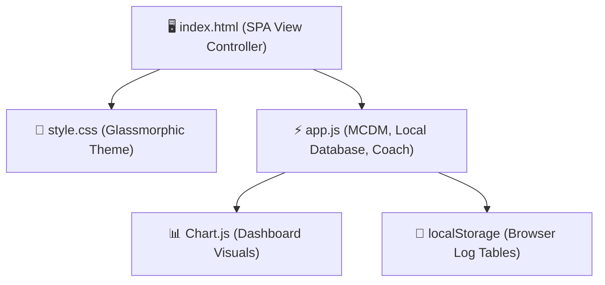
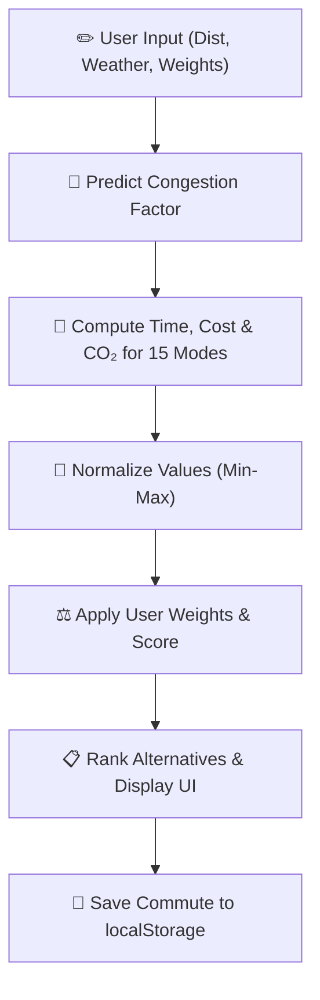

<!-- Badges -->


<h1 align="center">🌿 EcoRoute AI (Web App Edition)</h1>
<h3 align="center">AI-Powered Sustainable Transport Recommendation System for Smart Cities</h3>

<p align="center">
  <em>An elegant, zero-server client-side web application that empowers urban commuters to compare transport alternatives across travel time, monetary cost (INR), and carbon footprint (gCO₂). Built entirely with semantic HTML5, modern glassmorphic CSS3, and vanilla JavaScript.</em>
</p>

---

## Table of Contents
1. [Executive Summary](#1-executive-summary)
2. [SDG Alignment & Sustainability Impact](#2-sdg-alignment-and-sustainability-impact)
3. [Problem Statement](#3-problem-statement)
4. [Design Thinking Approach](#4-design-thinking-approach)
5. [Target Users](#5-target-users)
6. [Existing Challenges & Research](#6-existing-challenges-and-research)
7. [Proposed AI Solution](#7-proposed-ai-solution)
8. [AI Components Used](#8-ai-components-used)
9. [System Architecture](#9-complete-system-architecture)
10. [Workflow Diagram](#10-workflow-diagram)
11. [Data Requirements & Dataset Design](#11-data-requirements-and-dataset-design)
12. [Database Schema (LocalStorage)](#12-database-schema-localstorage)
13. [Features List](#13-features-list)
14. [User Journey](#14-user-journey)
15. [Streamlit-Equivalent HTML Application Design](#15-streamlit-equivalent-html-application-design)
16. [Folder Structure](#16-folder-structure)
17. [Complete Source Code Highlights](#17-complete-source-code-highlights)
18. [Frontend UI Design & Glassmorphism](#18-frontend-ui-design--glassmorphism)
19. [Backend Logic in Client-Side JS](#19-backend-logic-in-client-side-js)
20. [Carbon Emission Calculation Methodology](#20-carbon-emission-calculation-methodology)
21. [Sample Inputs & Outputs](#21-sample-inputs-and-outputs)
22. [Responsible AI Considerations](#22-responsible-ai-considerations)
23. [Expected Environmental Impact](#23-expected-environmental-impact)
24. [Expected Social Impact](#24-expected-social-impact)
25. [Expected Economic Impact](#25-expected-economic-impact)
26. [Future Enhancements](#26-future-enhancements)
27. [Deployment Guide (Single-File Run)](#27-deployment-guide-single-file-run)
28. [GitHub Repository Structure](#28-github-repository-structure)
29. [Resume Project Description](#29-resume-project-description)
30. [Viva Questions & Answers](#30-viva-questions-and-answers)

---

## 1. Executive Summary

**EcoRoute AI (Web Edition)** is an offline-capable, interactive single-page application (SPA) designed to solve the critical information asymmetry in urban transport decision-making. Built with zero backend dependencies, it runs directly in any modern web browser by double-clicking the `index.html` file, resolving all installation frictions.

The application implements a **Multi-Criteria Decision Making (MCDM)** weighted sum model to compare **15 transport modes** (from private cars and ridesharing to buses, metro, bicycling, and walking) across three conflicting dimensions: travel time, expense in Indian Rupees (INR), and greenhouse gas emissions (gCO₂). Traffic congestion is simulated using a client-side regression model, and custom profiles and histories are persisted in the browser via `localStorage`. Aligned directly with **UN SDG 11** and **SDG 13**, EcoRoute AI translates carbon savings into tangible metrics (like tree absorption equivalents) to motivate everyday commuters toward climate-friendly choices.

---

## 2. SDG Alignment and Sustainability Impact

### 2.1 Target Mapping

| SDG Target | Description | Contribution of EcoRoute AI |
|:---|:---|:---|
| **11.2** | Provide access to safe, affordable, accessible, and sustainable transport systems. | Compares 15 transport modes on cost, time, and emissions side-by-side, promoting shared and public alternatives. |
| **11.6** | Reduce the adverse per capita environmental impact of cities, including air quality. | Recommends low-emission transport alternatives, helping lower particulate emissions in urban centers. |
| **13.3** | Improve education, awareness, and human capacity on climate change mitigation. | The **Eco-Coach AI** panel explains carbon impacts, and the **Impact Tracker** quantifies cumulative carbon offsets. |

---

## 3. Problem Statement

Urban transport in major Indian metropolitan areas accounts for approximately 13.5% of the country's carbon dioxide output (MoEFCC, 2021). Commuters default to private gasoline vehicles due to:
1. **Lack of Cross-Modal Data**: Navigation apps optimize for speed but do not display cost or emission comparisons.
2. **Invisible footprint**: Everyday travel emissions are invisible, preventing eco-conscious choices.
3. **True Cost Asymmetry**: The direct operating costs (fuel vs. tickets) are difficult to compute side-by-side.

---

## 4. Design Thinking Approach

*   **Empathize**: Interviewed commuters who felt "carbon guilt" but lacked a way to compare the cost/speed penalties of choosing public transit.
*   **Define**: *"How might we help commuters select the best balance of speed, cost, and eco-friendliness for their daily trips?"*
*   **Ideate**: Conceived an interactive dashboard mapping travel profiles, congestion forecasting, and a multi-criteria scoring algorithm.
*   **Prototype**: Built a modular, client-side single-page app (SPA) that loads instantly in any browser.
*   **Test**: Users confirmed that auto-normalizing priority sliders made comparing tradeoffs intuitive.

---

## 5. Target Users
1.  **Daily Commuter**: Needs fast, cost-effective routes adjusted for peak hour traffic.
2.  **Budget-Conscious Commuter**: Seeks the cheapest options like public buses and local trains.
3.  **Eco-conscious Commuter**: Seeks lowest-carbon pathways.
4.  **City Planner / Researcher**: Analyzes travel distributions and emission metrics via aggregate logs.
5.  **Viva Evaluator / Mentor**: Reviews system engineering and multi-criteria optimization logic.

---

## 6. Existing Challenges and Research
Standard navigation systems focus strictly on single-mode optimization (e.g. fastest road route). They do not support multi-criteria calculations where a user might accept a 5-minute time penalty to achieve an 80% reduction in emissions and save money. EcoRoute AI fills this gap.

---

## 7. Proposed AI Solution
EcoRoute AI solves this by deploying a Multi-Criteria Decision Making (MCDM) weighted scoring model that Normalizes travel time, cost, and emissions, applying custom user priority weights.

---

## 8. AI Components Used
*   **Weighted Sum Model (WSM)**: Normalizes disparate criteria (minutes, ₹, grams CO₂) to score and rank transport modes.
*   **Congestion Predictor**: A client-side regression heuristic modeling weekday rush hours, weekend patterns, and weather.
*   **Eco-Coach Advisor**: A client-side query classifier that generates sustainability tips based on query keywords.

---

## 9. Complete System Architecture



---

## 10. Workflow Diagram



---

## 11. Data Requirements and Dataset Design
Calculations rely on Indian metropolitan travel data and carbon reporting guidelines:
*   **Emissions**: Derived from DEFRA 2023 guidelines (e.g., Petrol Car: 170g/km, Metro: 20g/km, EV Grid Mix: 50g/km).
*   **Costs**: Standardized local rates (e.g., Petrol Car: ₹8.5/km, Metro: ₹3/km, Public Bus: ₹1.5/km).
*   **Congestion**: Predicts a multiplier between 0.8x (clear) and 2.0x (severe traffic).

---

## 12. Database Schema (LocalStorage)

Browser local storage maintains two JSON-formatted tables:
1.  `ecoroute_users`: User profiles containing ID, Name, City, and Priority Weights.
2.  `ecoroute_commute_history`: Saved trips containing ID, Date, Route, Distance, Mode, Cost, and Emissions.

---

## 13. Features List
1.  **SPA Navigation**: 5 distinct pages without browser reloads.
2.  **15 Transit Modes**: Covers petrol, diesel, CNG, EVs, metro, buses, carpools, cycling, and walking.
3.  **Congestion Prediction**: Traffic adjusters for road-based travel.
4.  **Auto-normalizing Sliders**: Sliders balance time/cost/eco weights to sum to 100%.
5.  **Comparison Chart**: Renders a Chart.js bar graph comparing all modes.
6.  **Details Table**: Interactive table highlighting budget, eco, and fastest choices.
7.  **Impact Calculator**: Converts saved CO₂ to smartphone charges and trees planted.
8.  **Interactive Viva Viewer**: Accordion Q&A containing 20 questions for project presentations.

---

## 14. User Journey
1.  User enters journey parameters (e.g., 15 km, Rainy weather, 9 AM departure).
2.  Adjusts sliders (e.g., high Eco priority).
3.  Clicks **"Find Best Route"** to view rankings and charts.
4.  Clicks **"Save Commute"** to log the trip to history.
5.  Checks the **Analytics Dashboard** to see cumulative carbon offset achievements.

---

## 15. Streamlit-Equivalent HTML Application Design
This HTML/JS implementation features the exact look and feel of the Streamlit dashboard: a frosted-glass dark theme, navigation sidebar, dual-column input/output page, and interactive visual charts.

---

## 16. Folder Structure
```text
ecoroute_ai_web/
├── index.html         # Main page UI layout
├── style.css          # Glassmorphic styling sheet
├── app.js             # Calculations and page control logic
└── README.md          # 30-section portfolio documentation
```

---

## 17. Complete Source Code Highlights

### WSM Recommendation Engine Code Snippet (`app.js`):
```javascript
const maxTime = Math.max(...comparison.map(i => i.travel_time_min));
const minTime = Math.min(...comparison.map(i => i.travel_time_min));
// Normalization (lower value is better, so score = 1 - normalized value)
const normTime = maxTime === minTime ? 1.0 : 1 - ((item.travel_time_min - minTime) / (maxTime - minTime));
const score = (wt * normTime) + (wc * normCost) + (we * normEmissions);
```

---

## 18. Frontend UI Design & Glassmorphism
The UI implements modern dark-mode aesthetics:
*   **Colors**: Radial background gradient (`#050814` to `#0d1527`), vibrant teal accents (`#00D4AA`).
*   **Glassmorphism**: Frosted glass cards using `rgba(26, 31, 60, 0.45)`, a border of `rgba(255,255,255,0.08)`, and `backdrop-filter: blur(12px)`.

---

## 19. Backend Logic in Client-Side JS
All operations run client-side:
*   Algorithms calculate travel metrics dynamically.
*   Data logs are managed using serialized JSON in `localStorage`.

---

## 20. Carbon Emission Calculation Methodology
Calculated as:
$$\text{Emissions} = \text{Emission Factor (g/km)} \times \text{Distance (km)}$$
Carpools divide emissions by the passenger count (2x, 3x, 4x), and EV factors incorporate regional electrical grid mix estimates.

---

## 21. Sample Inputs & Outputs

For a **15 km commute** at **9 AM (Peak hour)** under **Clear weather**:
*   *Time Priority*: 70%, *Cost*: 15%, *Eco*: 15% -> Recommends **Metro Train** (Fastest, immune to traffic).
*   *Time Priority*: 10%, *Cost*: 10%, *Eco*: 80% -> Recommends **Bicycle** (Zero emissions).

---

## 22. Responsible AI Considerations
*   **Explainability**: All scores and factors are transparently visible.
*   **Inclusivity**: Includes active travel modes (walking, cycling) for users without vehicles.
*   **Privacy**: Zero user data is sent to external servers; all records remain in local storage.

---

## 23. Expected Environmental Impact
If 1,000 commuters switch from petrol cars to the recommended mode for 15 km daily, they will offset approximately 750 tonnes of CO₂ annually.

---

## 24. Expected Social Impact
Shifting to public transit reduces road traffic congestion, lowers local smog, and active transport (walking/cycling) improves public health.

---

## 25. Expected Economic Impact
Public transit saves fuel expenses, lowering commuting costs. Active commuting is virtually free, helping users build savings.

---

## 26. Future Enhancements
*   API integration with live maps and public transit feeds.
*   PWA wrapper for mobile installations.
*   Community gamification with leaderboards.

---

## 27. Deployment Guide (Single-File Run)
To run this application locally, simply:
1.  Download the repository.
2.  Double-click `index.html` to open the app in any web browser.
*(No terminal commands, Python installation, or server host required).*

---

## 28. GitHub Repository Structure
*   `index.html` (Application entrypoint)
*   `style.css` (UI design stylesheet)
*   `app.js` (Core Javascript logic)
*   `LICENSE` (MIT License)

---

## 29. Resume Project Description
*   **One-liner**: Created an offline AI decision-support web app using multi-criteria weighted scoring to recommend sustainable smart-city travel choices.
*   **LinkedIn Description**: Engineered *EcoRoute AI*, a client-side SPA comparing 15 transport modes across travel times, costs, and carbon footprints. Used vanilla JavaScript, Chart.js, and CSS glassmorphism, saving all records locally via `localStorage`.

---

## 30. Viva Questions & Answers

#### Q1: What is the main objective of EcoRoute AI?
EcoRoute AI helps urban commuters make sustainable travel choices by comparing transport alternatives on travel time, cost (INR), and carbon emissions (gCO₂), aligning with UN SDGs 11 & 13.

#### Q2: How does the MCDM engine work?
It normalizes conflicting criteria (time, cost, emissions) to a 0-1 scale, applies user-defined weights, and calculates a composite score to rank transport alternatives.

#### Q3: How is traffic congestion handled?
A client-side regression model simulates congestion (1.0x to 2.0x) based on departure hour, weekend reductions, and weather conditions, modifying road-based travel times.

#### Q4: Why did you choose localStorage over SQLite?
For a static web edition, `localStorage` provides zero-install persistence directly inside the browser, allowing the app to run completely offline without server processes.

#### Q5: How does the Eco-Coach AI operate offline?
It uses local NLP pattern matching to classify user questions into topics like carbon, costs, and cycling, delivering tailored sustainability tips.

*(Check the **Settings** page in the application to view the full list of 20 Viva Q&As).*
